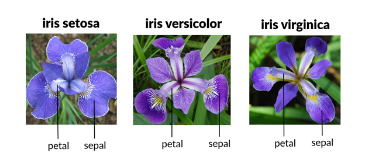

# Principles of Data Analytics

## *Weekly Tasks*

## Overview 🌺

This repository contains ten weekly task submissions completed as part of the assessment requirements for the *Principles of Data Analytics* module at Atlantic Technological University – Galway.

The purpose of this repository was to document my introductory journey into data analytics, undertaken as a novice learner. Over a series of ten weekly tasks, I engaged with foundational concepts in data analysis using Python and Jupyter Notebooks, with the well-known Iris dataset serving as the central focus of exploration.

Each task introduced a core element of the data analytics pipeline:

  1. **Sourcing the Dataset:** I began by importing the Iris dataset, gaining familiarity with accessing and loading structured data using sklearn.

  2. **Exploring the Data Structure:** I examined the dataset’s features, data types, and general format, developing an understanding of how datasets are organized.

  3. **Summarizing the Data:** Descriptive statistics were computed to observe central tendencies and spread, enhancing my grasp of numerical summaries.

  4. **Visualizing Features – Histograms:** I used matplotlib to create histograms, learning how to assess distributions of individual features.

  5. **Investigating Relationships – Scatterplots:** Scatterplots allowed me to begin examining pairwise relationships between features.

  6. **Analyzing Relationships – Regression Line:** I incorporated a regression line into a scatterplot to understand linear trends and strengthen visual interpretation, using numpy.polyfit. 

  7. **Class Distributions – Boxplots:** Boxplots of petal lengths by species were created to investigate intra-class variability and inter-class distinctions.

  8. **Computing Correlations – Heatmap:** I calculated the correlation coefficients between the features and visualized them using a heatmap, using matplotlib, to identify strong or weak feature relationships.

  9. **Fitting a Simple Linear Regression:** I used SciPy to fit a simple linear regression between two features from Task 5 and calculated the coefficient of determination (R²) to assess the model's explanatory power. The scatterplot from Task 6 was re-created and annotated with the R² value using Matplotlib, enhancing the interpretation of the relationship.

  10. **Creating a Pair Plot:** Finally, a comprehensive pair plot using seaborn enabled simultaneous visualization of all feature relationships and class distinctions.

I utilized essential Python libraries such as NumPy, SciPy, pandas, matplotlib, seaborn, and scikit-learn. These tools supported data manipulation, statistical computation, and visualization, forming a practical foundation for future work in data science and analytics.

author: Niamh Hogan

## About this repository 🌺

This repository is comprised of the following files and folders:  

  - A **README** file that contains  
  - A **requirements.txt** file containing all the Python packages that the code depends on & their versions.  
  - A Jupiter Notebook, titled **tasks.pynb** that contains --

## Dependencies 🌺  
* python==3.12.1  
Python --
* numpy==2.2.0  

* scipy==1.14.1  

* matplotlib.pyplot==3.9.3  

* seaborn==0.13.2  

* pandas==2.2.3  

* scikit-learn==1.6.0  

## Environment Setup 🌺

## How to Download Repository 🌸

## How to Run the Code 🌸

## Technologies

- Python
- Git
- GitHub
- Codespaces
- Jupyter